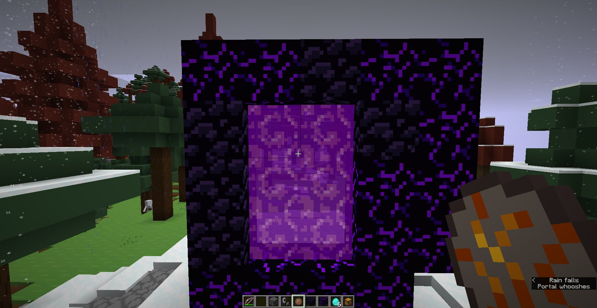

# ObsiCry (Minecraft 1.21.5 only)

**ObsiCry** is a simple Minecraft Fabric mod that allows Nether portals to be built using any mix of **obsidian** and **crying obsidian**.

### 🔥 See it in action:
Join **The Netherhood** at  
**`netherhood.blockworlds.io`**  
or direct IP: **`76.164.199.69:25565`**

---

  

## Setup

Upload the .jar file to your mods/ directory.

## License

This is available under the MIT license.
